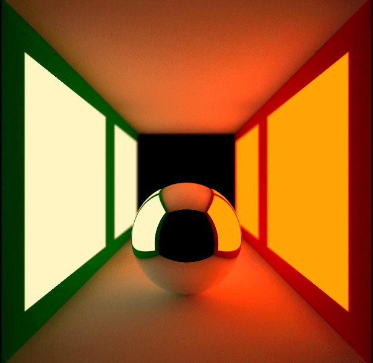

# Software raytracer in rust

|  |
|:----------------------------------------------------------------------:|
|                      Modified Cornell Box example                      |

### Features
* Multicore rendering
* Questionable multithreading messaging style
* Absolutely no optimisations

If you're interested, here's the main inspiration for this project:  
[_Ray Tracing in One Weekend_](https://raytracing.github.io/books/RayTracingInOneWeekend.html)
